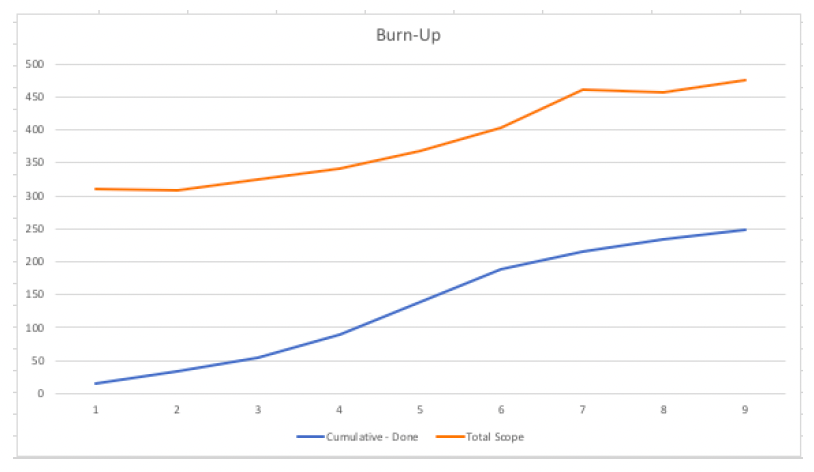

First Impressions

- Presents well.
- Well spoken presents well
- Formal conversation, might have been because of nerves. Seems pleasant

Patterns and Problems

- [ ] Story dependencies. Not vertical slices.
- [ ] Scope being added to resulting in 200 backlog + 27 in progress after Sprint 9.
- [ ] Calculations required to complete the burn up with total scope line:
- [ ] Current work cannot be completed. (Burn up should show this clearly.)
- [x] Backlog in testing.
- [x] Large tasks 20, 13s,
- [x] ??
- [x] blanks.
- [x] Velocity Vs number of points planned.

Burn up chart should be as follows -

**Key things to ask:**

- Why can’t everything be delivered by the launch date?
- Why can’t we just get everyone to work longer hours?
- Can we get some more people to help?

**Key things to look out for:**

- [ ] Is the candidate able to articulate that the date cannot be met and provide alternative options for the delivery. i.e. Scale back scope, release a cut-down version to a beta group…. re-prioritise.
- [ ] Can they talk to MVP/ Beta / test trial release and the value of that as an approach (i.e Lean start-up)
- [ ] Some of the PBI’s look questionable from an initial release perspective: o i.e. As a customer with more than one account I want to select the account to view so that I can view my data use - needed day 1?
- [ ] Are they able to look at the bigger picture, point to the goals of the initiative beyond a launch date. For organisational success, test and learn is essential. The team needs to be on hand to react to changes, bugs and other issues and they are not burned out to hit the launch date.
- [ ] More people will slow the team down in the short term - time to form, upskill test.