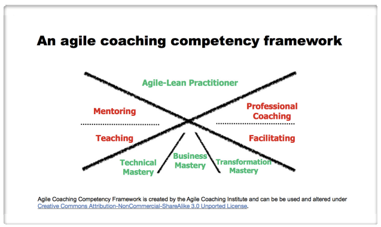

**Company and culture**

E8 Values

\- "Draw connections between E8's values

Our beliefs, aims and expeditions, strategy and OKR's

\- "Demonstrate an understanding of E8s Belief's aims and expeditions, Discuss contribution

Learning culture and knowledge sharing

\- "Would like more evidence bringing knowledge back to E8, talk about experience in mentoring less experienced Elabor8ers, elaborate more on EDMI experience
  \- speak about the dashboards created and presented back to the QLD group

**Personal Growth**

Depth of Skills

\- Elaborate more on you ability to act as a Generalist

\- I ran a CDP Reset workshop at my client Michael Hill. This involved CIO and CTO level executives as well as external vendors. Set SMART goals for the upcoming workstream and was able to facilitate open and frank discussions around the state of the project and its future direction.

\- looking to expand my horizons as an agile coach. Lysa Adkins Agile coaching competency framework - 

I'm looking to expand my knowledge through my PDP in the areas of Facilitation - IC Agile Facilitation

Through exposure to other clients I'm hoping expand my knowledge into areas like Transformation Mastery.

\- Discuss more on playing back observations and recommendations, expound more on being a consultant to the org than a specific role

\- Working within MHJ across eCommerce

Professional Development

\- Discuss how your training has been applied at client to achieve a better outcome

\- Management 3.0 -> Cultivate Happiness by focusing on individuals and Cultivate engagement by focusing on interactions

\- Give more examples of mentoring

\- Use some of these examples as a generalist for other areas

**Client Delivery**

Exceeding client expectations - Discuss feedback from client, CCX

Stakeholder management

\- Talk more about experience at MHJ

\- What relationships has he built with leaders

Leading outcomes / Teams

\- Discuss depth of leadership

\- Talk more about your Scrum of scrums experience

\- Discuss managing people / Teams (may draw from previous experience)

===== CTE 100 course ===