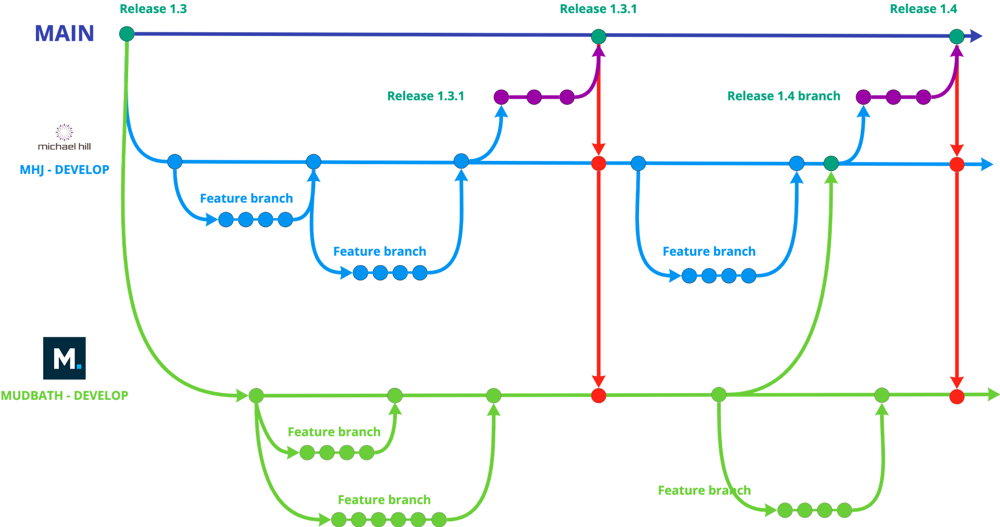

Ways of working workshop.

discussion points

how to work in parallel?

Processess for how MHJ devs can contribute to the codebase

What elements can be owned by the MHJ team?

Can Mudbath work on the critical path elements?

Delivery on a timeline? Minimising scope increase and slippage

Design system?

\- Alert bar... continued collaboration?

**Branching and release proposal**

