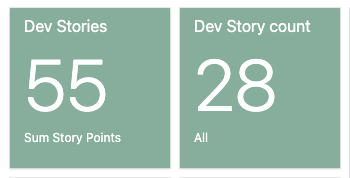
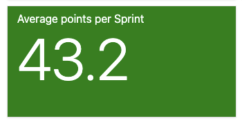
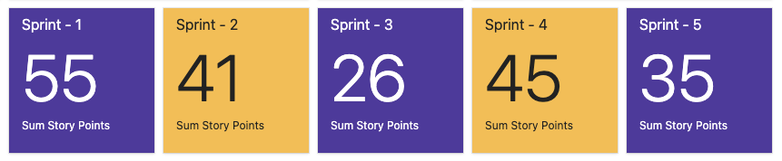
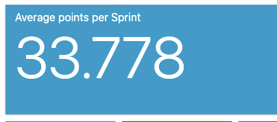
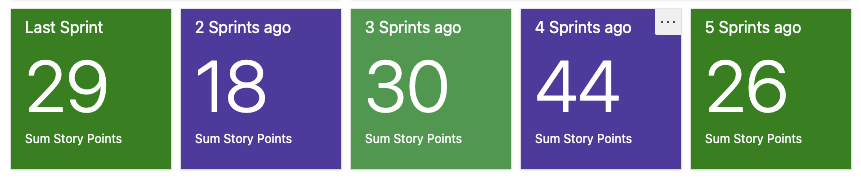

Highlights of stories delivered

**Special Orders**

- My Bag lead time callout
- Perpetual stock products show on site
- Special orders variations appear in standard selectors (dropdown swatches) VUE
- My Account Order history + order details | MTO Callout + Order status
- Special orders can't be engraved
- Investigation: SO Lead time and range do not match

**Adyen**

- Adyen Cart Implementation (component)
- Vue - Content redirects - /general-terms; /customer-service/terms/terms

**Trade**

- Updates to the CSP rules for Barilliance slide-in component
- Cloudflare routing : /competitions; /article/engagement-guides/all-about-gold; /article/care-maintenance/jewellery-care-information
- Adding stores to SFS Comestri logic
    

# Sprint Statistics

|  | \# **Sprint 22.17 - "Q" Statistics** |
| --- | --- |
| Completed Story breakdown |  |
| Total Closed and Resolved |  |
| Development Last 5 Sprints |  |
| UX Last 5 Sprints |  |

We are showing good progress sprint to sprint and and are delivering more and more stories. One thing to note is that we are also battling rollover of stories. This indicates that we are carrying too many stories in a given sprint. For the 22.18 sprint ware focused on closing out the rollover stories before taking on new stories from the next sprint. This will impact on our delivery plan (as we had to push out international shipping  stories that were planned for 22.18) but the priority order of the features to be delivered remains as follows - 

1.  Special Orders
2.  International Shipping
3.  Project Baguette