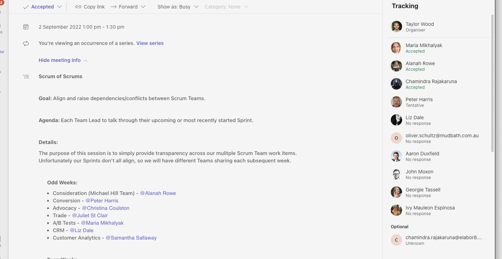

Presented the sprint dashboards

Initiated conversations about Cycle time and Lead time metrics.

Discussed the current issues with story workflow

Action

- [ ] Raise the story workflow with the developers in the development retrospective
    - [ ] speak with John about raising this

=== 30/08/2022 14:30 ===

Upcoming sprints are key for releases

Project Baguette appears to be the one that may slip later

- [x] Close out last sprint stories
- [ ] Charge for Engraving
- [x] Take charge of Scrum of Scrums
- [x] Create a Scrum of Scrums thread.. in Teams

17/01/2023 15:31 - FIRST CATCH UP OF 2023

Migration team, needs more developers... we are still yet to get a good understanding of Velocity there.

I expect the 2 sprints post new year will give us a more accurate understanding of team velocities for both migration and growth and optimisation teams.

Quite a few blocker to do with Comestri - John and Andy are handling these interactions and hopefull will be able to give the business a good understanding of the impact 

to Baguette