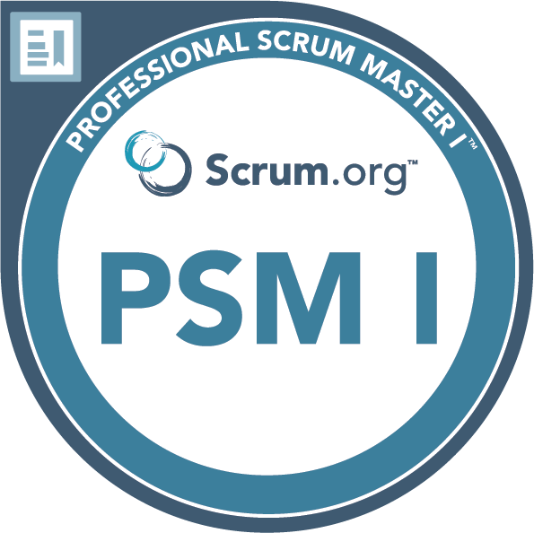

There are quite a few frameworks in the Agile space - 
[Scrum](https://www.scrum.org/learning-series/what-is-scrum), [LeSS](/Applications/Joplin.app/Contents/Resources/app.asar/Large%20Scale%20Scrum%20%28LeSS%29:%20Overview%20%20Large%20Scale%20Scrum%20https:/less.works), [SAFe](https://scaledagileframework.com/)
Pathway to Scrum master role. There are several places that provide certification.

I have heard good things about scrum.org and ICAgile

 Professional Scrum Master 1 - scrum.org - This is a good course to get your first training as a scrum master.

You have lots of pathways -

- Continue along the scrum master path - PSM2
- Look into Product ownership - Professional Scrum Product Owner
- You can also go into the agile coaching path -
- IC Agile also provides some tracks that give you a pathway for specific areas of focus - [agile-certification](https://www.icagile.com/agile-certification)
- Elabor8 also offers course that might be useful - https://elabor8.com.au/academy/

## **
Reading materials / Tools / talks that I have found useful**

- Scaled Agile Framework - SAFe - https://scaledagileframework.com/
- [Scrum.org - https://www.scrum.org/learning-series/what-is-scrum](https://www.scrum.org/learning-series/what-is-scrum "Scrum.org - What is scrum")
- [All the remote things](https://www.youtube.com/@talkingRemote "All the remote things") \- This youtube channel is hosted by Tony Ponton he's very experienced in the agile space.
- ***RetroTool***\- https://retrotool.io/ \- Useful for running retrospectives. Its good to change things up every so often.. otherwise retro's can get stale. **Podcasts that may be useful**
- ***Scrum master toolbox podcast***: a great podcast for tools and tips for scrum masters - https://podcasts.apple.com/us/podcast/scrum-master-toolbox-podcast/id963592988
    
- ***The Meta-Cast, An Agile podcast*** \- https://www.meta-cast.com/
    
    - https://www.meta-cast.com/episode/episode-204-the-tactics-of-great-retrospectives
        
    - https://www.meta-cast.com/episode/episode-200-great-agile-planning
        
    - https://www.meta-cast.com/episode/great-standup-meetings
        
    - https://www.meta-cast.com/episode/episode-193-youre-a-scrum-master-now-what